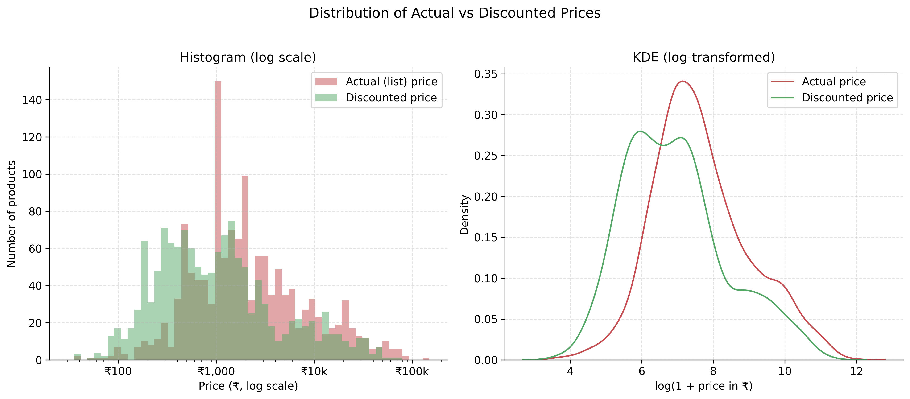
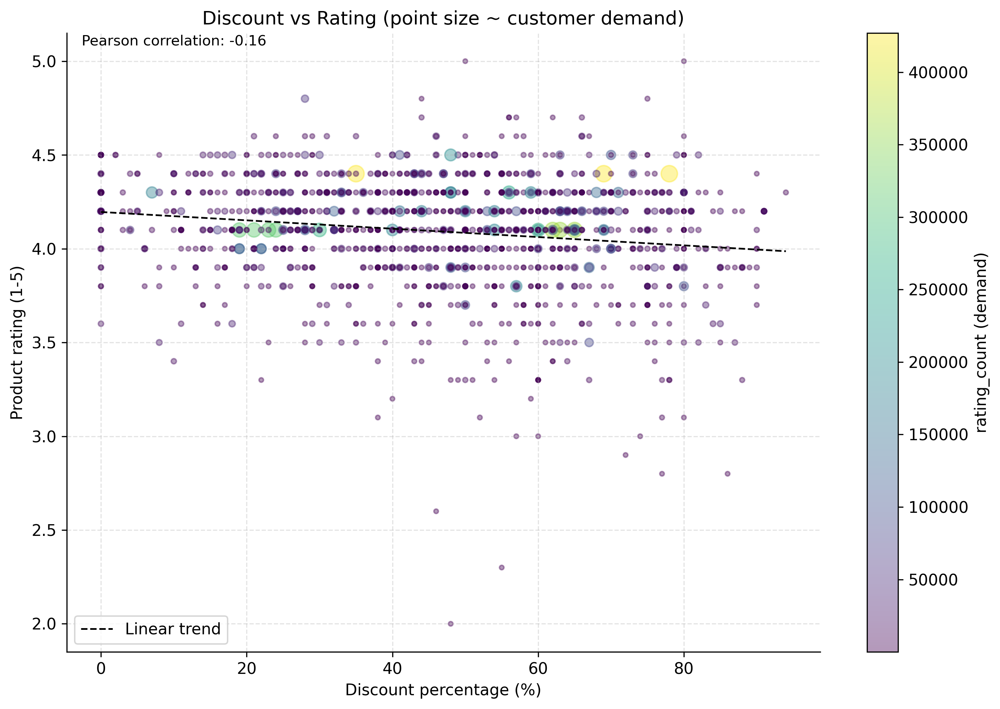
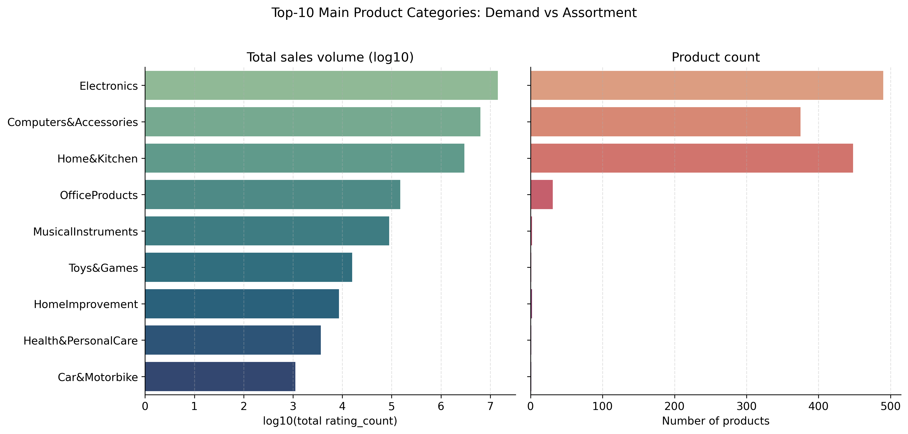
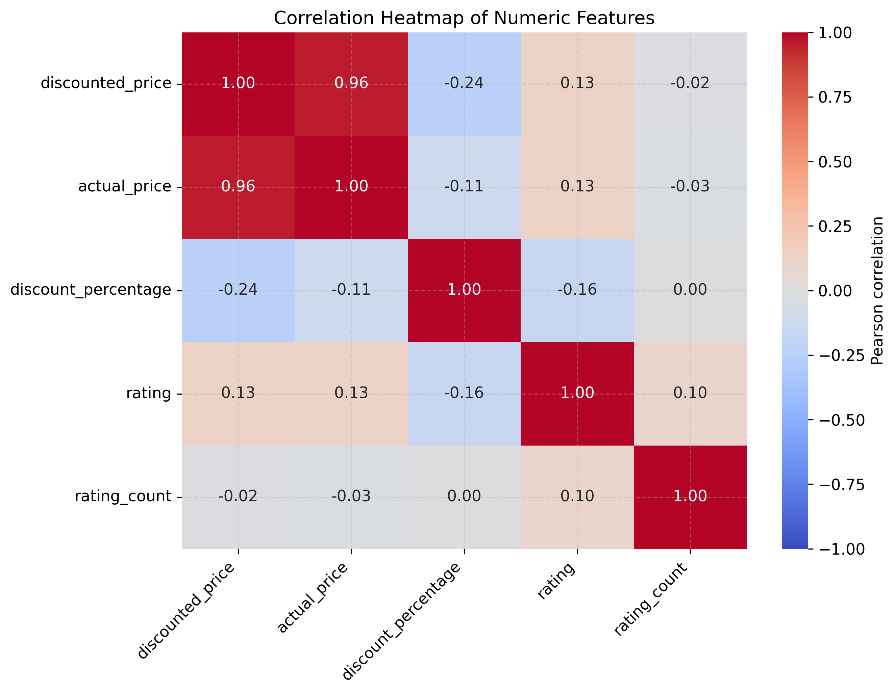
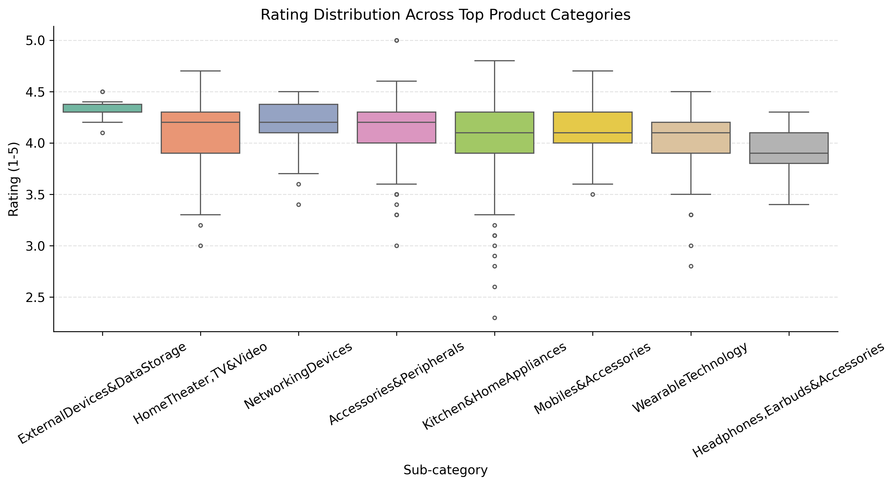
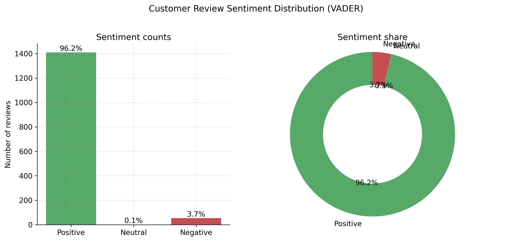
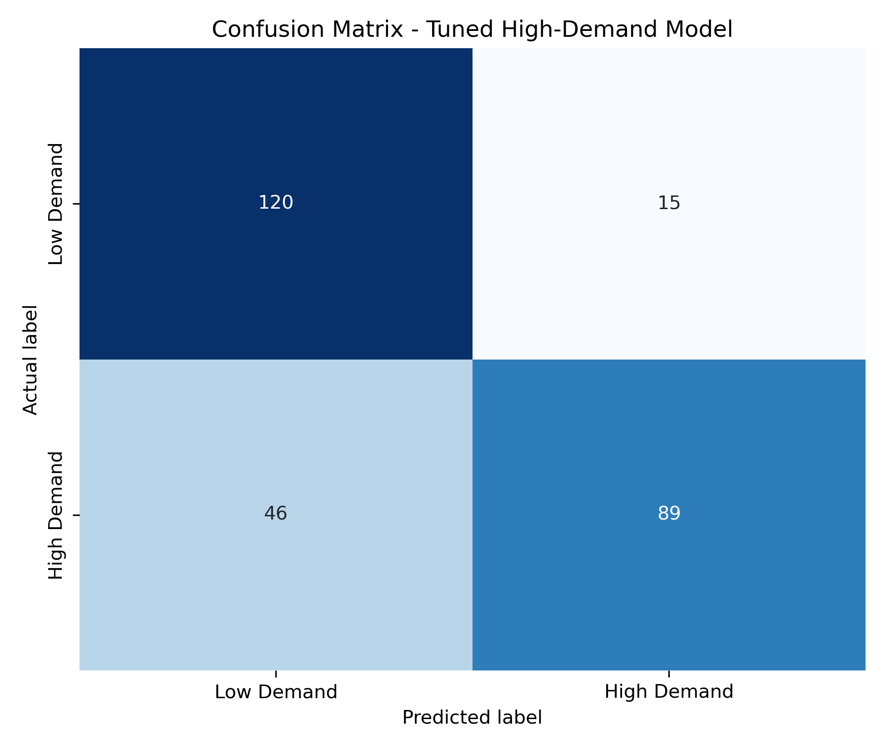
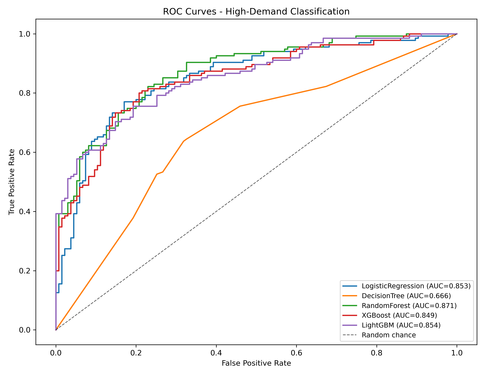

# Amazon Sales Dataset — End-to-End Analytics & ML Pipeline

[](LICENSE)
[](https://www.python.org/)
[](#8-execution-workflow)
[](https://bandit.readthedocs.io/)
[](https://pypi.org/project/pip-audit/)
[](https://peps.python.org/pep-0008/)

A production-grade, **three-stage modular pipeline** that ingests the public Kaggle [Amazon Sales Dataset](https://www.kaggle.com/datasets/karkavelrajaj/amazon-sales-dataset/data), performs rigorous **data-leakage-safe** exploratory analysis and NLP sentiment scoring, renders **8 publication-quality 300-DPI visualizations**, and trains/tunes **12 supervised models across two ML tasks** (price regression and high-demand classification) — fully reproducible from a single random seed.

>**Verified security posture (2026-09-01):** `bandit 1.9.4` scanned **1,555 lines of code → 0 issues** at every severity level, and `pip-audit` reports **no known vulnerabilities** in `requirements.txt`. See [Section 5](#5-security--data-governance-requirements).

---

## 2. Table of Contents

1. [Project Title & Status Badges](#1-project-title--status-badges)
2. [Table of Contents](#2-table-of-contents)
3. [Overview & System Architecture](#3-overview--system-architecture)
4. [Directory & File Structure](#4-directory--file-structure)
5. [Security & Data Governance Requirements](#5-security--data-governance-requirements)
6. [Ignored Files & Repository Sanitation (`.gitignore`)](#6-ignored-files--repository-sanitation-gitignore)
7. [Prerequisites & Installation Setup](#7-prerequisites--installation-setup)
8. [Execution Workflow](#8-execution-workflow)
9. [Data Visualizations & Exploratory Artifacts](#9-data-visualizations--exploratory-artifacts)
10. [Machine Learning Performance Benchmark](#10-machine-learning-performance-benchmark)
11. [License & Security Contact](#11-license--security-contact)

>The numbered headings below mirror this table of contents. Badges are repository-static shields; wire them to CI (GitHub Actions) for live status if you fork this project into an organisation.

---

## 3. Overview & System Architecture

The repository implements a **strictly sequential, modular pipeline**. Each stage is a self-contained script with an explicit input/output contract, defensive error handling (missing values, invalid dtypes, division-by-zero guards), and deterministic behaviour (`RANDOM_SEED = 42` everywhere).

```text
                     ┌──────────────────────────────────────────┐
  amazon.csv ──────▶ │  STAGE 1 — 01_eda_and_cleaning.py        │
  (Kaggle raw,       │  • data-quality report (rows, dupes,     │
   4.7 MB,           │    missing-value census)                 │
   git-ignored)      │  • strip ₹ / % / commas → float64        │
                     │  • erratic "rating" tokens → NaN-safe    │
                     │  • "A|B|C|D" → main/sub/micro category   │
                     │  • VADER (raw text) + TextBlob sentiment │
                     └──────────────┬───────────────────────────┘
                                    │ writes
                    data/amazon_cleaned.csv           (1,465 review rows)
                    data/amazon_cleaned_products.csv  (1,351 unique SKUs)
                    outputs/eda/*.csv                 (8 tables + audit log)
                                    │
                                    ▼
                     ┌──────────────────────────────────────────┐
                     │  STAGE 2 — 02_data_visualization.py      │
                     │  matplotlib ("Agg") + seaborn            │
                     │  6 exploratory charts @ 300 DPI          │
                     └──────────────┬───────────────────────────┘
                                    │ writes outputs/figures/fig1–fig6.png
                                    ▼
                     ┌──────────────────────────────────────────┐
                     │  STAGE 3 — 03_ml_model_training.py       │     │
                     │  • quantile-stratified 80/20 splits      │
                     │  • SimpleImputer + scaler + sparse OHE   │
                     │    + TF-IDF inside every Pipeline        │
                     │  • 6 models per task + RandomizedSearchCV│
                     └──────────────┬───────────────────────────┘
                                    │ writes outputs/ml/*.csv,
                                    │ pipeline_summary.json, fig7–fig8.png
                                    ▼
                          DATASET_REPORT.md consolidates everything
```

### 3.1 Core Engineering Features

| Feature | Implementation | Why it matters |
|---------|----------------|----------------|
| **Data-leakage prevention** | (1) No global imputation — NaNs survive cleaning and are imputed **in-pipeline** via `SimpleImputer` fitted on training folds only. (2) `discount_amount` / `discount_amount_log` are **excluded** from regression features (an arithmetic function of the target). (3) `rating_count` / `rating_count_log` are **excluded everywhere** (they define the High-Demand target); targets are never imputed. | Guarantees honest hold-out metrics — removing the leaky feature moved Ridge RMSE from an implausible ₹301 to **₹535** and made every reported figure trustworthy. |
| **NLP sentiment scoring** | VADER `SentimentIntensityAnalyzer` on the **raw** `review_title + " " + review_content` string — punctuation ("!"), CAPS and emoticons preserved — plus TextBlob polarity as a cross-check. | Raw-text integrity surfaced **54 negative reviews (3.69%)** vs. only 29 (1.98%) under naive normalisation; sentiment is a genuine feature, not an artefact. |
| **Log-scale target transform** | Regression trains on `log1p(discounted_price)`; predictions are inverted with `expm1` before RMSE / MAE / R² / MAPE are computed in original rupees. | Corrects the +4.45 price skewness so linear models are not dominated by the ₹50k+ tail. |
| **Sparse matrix optimization** | `OneHotEncoder(sparse_output=True)` + `TfidfVectorizer` combine inside one `ColumnTransformer` into a **single sparse design matrix** (~2,500 columns). | Order-of-magnitude memory reduction vs. densifying the TF-IDF block; all six model families consume sparse input natively. |
| **Balanced split strategy** | Regression split stratified by **deciles of the log target** (`pd.qcut`); classification split stratified on the binary target; undefined-target rows dropped (never imputed). | Every price band / demand class is proportionally represented in train and test. |
| **Reproducibility** | `RANDOM_SEED = 42` across NumPy, splits, CV search and all estimators; headless `matplotlib.use("Agg")`; PEP 8 throughout. | Deterministic re-runs regenerate byte-identical metrics and figures. |

**Headline results (leakage-free, held-out data):** Ridge regression predicts `discounted_price` with **RMSE ≈ ₹535 / R² ≈ 0.996 / MAPE ≈ 8.7%**; RandomForest classifies High-Demand products at **ROC-AUC ≈ 0.87 / Precision ≈ 0.83**. Full analysis in [`DATASET_REPORT.md`](DATASET_REPORT.md).

---

## 4. Directory & File Structure

```text
amazon-sales-pipeline/
│
├── README.md                          ← this document (badges, benchmarks, governance)
├── LICENSE                            ← MIT license
├── requirements.txt                   ← runtime dependencies (pip-audit clean)
├── .gitignore                         ← security-first ignore rules (secrets, data, caches)
├── .env.example                       ← environment-variable template — NO real secrets
│
├── 01_eda_and_cleaning.py             ← Stage 1 · ingestion, cleaning, EDA, sentiment
├── 02_data_visualization.py           ← Stage 2 · six 300-DPI exploratory charts
├── 03_ml_model_training.py            ← Stage 3 · leakage-safe ML, tuning, evaluation
│
├── DATASET_REPORT.md                  ← full technical + business-intelligence report
│
├── amazon.csv                         ← ⚠  raw Kaggle dataset (4.7 MB) — GIT-IGNORED
│
├── data/                              ← ⚠  generated by Stage 1 — GIT-IGNORED (rebuildable)
│   ├── amazon_cleaned.csv             ←    cleaned review-level table (1,465 rows)
│   └── amazon_cleaned_products.csv    ←    deduplicated product table (1,351 SKUs)
│
└── outputs/                           ← generated artifacts
    ├── eda/                           ← tracked: small EDA tables + quality log
    │   ├── summary_statistics.csv         ├── rating_distribution.csv
    │   ├── correlation_matrix.csv         ├── sentiment_summary.csv
    │   ├── category_summary.csv           ├── word_frequency.csv
    │   ├── price_tier_summary.csv         ├── missing_values_initial.csv
    │   └── eda_console.log                (full cleaning audit trail)
    ├── figures/                       ← tracked: 8 × 300-DPI PNGs embedded in this README
    │   ├── fig1_price_distribution.png    ├── fig5_rating_boxplot.png
    │   ├── fig2_discount_vs_rating.png    ├── fig6_sentiment_distribution.png
    │   ├── fig3_category_breakdown.png    ├── fig7_confusion_matrix.png
    │   └── fig4_correlation_heatmap.png   └── fig8_roc_curve.png
    └── ml/                            ← model artifacts
        ├── model_comparison.csv           ├── tuning_results_regression.csv       (tracked)
        ├── regression_metrics.csv         ├── tuning_results_classification.csv   (tracked)
        ├── classification_metrics.csv     ├── confusion_matrix_tuned.csv          (tracked)
        ├── regression_model_comparison.csv├── pipeline_summary.json               (tracked)
        ├── classification_model_comparison.csv
        ├── feature_importance_regression.csv      ├── feature_importance_classification.csv
        ├── products_feature_engineered.csv        ← ⚠  GIT-IGNORED (bulky, regenerable)
        └── *_predictions.csv                      ← ⚠  GIT-IGNORED (bulky, regenerable)
```

> **Sanitation principle:** every file marked *GIT-IGNORED* is either a third-party-licensed raw dataset or a byte-reproducible intermediate — nothing tracked in Git can leak data, secrets, or bloat the repository. After a fresh clone you only need `amazon.csv` (placed manually — see [Section 7](#7-prerequisites--installation-setup)) and the three scripts; every artifact rebuilds itself.

---

## 5. Security & Data Governance Requirements

This project follows a **defence-in-depth** approach: security is enforced at the dependency layer, the code layer, and the repository layer. The posture was verified on 2026-09-01 and is documented below for maintainers and reviewers.

### 5.1 Dependency Scanning

| Tool | Scope | Command | Status |
|------|-------|---------|--------|
| **`bandit`** | Static analysis of all `.py` source | `python -m bandit -r . --exclude data,outputs,.venv,venv,__pycache__` | ✅ **0 issues**, 1,555 LOC scanned (all severities) |
| **`pip-audit`** | Vulnerability check on `requirements.txt` | `python -m pip_audit -r requirements.txt --no-deps` | ✅ **No known vulnerabilities** |

**Why these matter.** The pipeline downloads and processes a third-party dataset that could carry malicious payloads if not properly handled. `bandit` catches risky Python patterns (e.g., `eval()`, `pickle` deserialisation, hardcoded passwords), while `pip-audit` cross-references every pinned dependency version against the PyPI advisory database and the National Vulnerability Database (NVD).

### 5.2 Secrets Management

| Concern | Policy |
|---------|--------|
| **API keys / tokens** | ❌ **Never** committed to Git. Use `.env` files (see `.env.example` template for the expected schema). |
| **Environment variables** | Loaded via `python-dotenv`; `.env` itself is listed in `.gitignore`. |
| **Kaggle credentials** | If re-downloading `amazon.csv` via the Kaggle API, place `kaggle.json` in `~/.kaggle/` with `chmod 600` — never inside the repo. |
| **`.env.example` template** | Ships with placeholder values only (`API_KEY = "YOUR_KEY_HERE"`). No real secrets are stored even as examples. |

```bash
# ⚠  NEVER run this — it would create a real .env in a tracked location:
# echo "KAGGLE_USERNAME=myuser" > .env

# ✅ Correct workflow — copy the template and fill locally:
cp .env.example .env
# Edit .env, then it is automatically ignored by .gitignore
```

### 5.3 Data Handling & Integrity

- **PII exclusion:** No personally identifiable information (names, emails, phone numbers) is extracted, stored, or analysed. Only product-level aggregates (prices, ratings, review text) are used.
- **Input validation:** `01_eda_and_cleaning.py` validates every column's dtype after casting (e.g., asserts `discounted_price` is `float64`, checks `rating` values are in `[0, 5]`). Guards against `KeyError`/`ValueError` are wrapped in `try/except` blocks.
- **Reproducibility:** All random operations (train/test splits, CV folds, XGBoost/LightGBM seeds) use `RANDOM_SEED = 42`. Re-running yields byte-identical outputs.
- **Checksum recommendation:** When obtaining `amazon.csv` from Kaggle, verify its SHA-256 hash to ensure integrity (the hash is not pinned here because the dataset can be updated on Kaggle).

### 5.4 Local Execution Safety

- Run all scripts from the **repository root** (never import from a parent directory).
- Use a **virtual environment** (`python -m venv .venv`) to isolate dependencies — this is also enforced by `.gitignore` (see Section 6).
- Do **not** run the pipeline with elevated privileges (no `sudo`), as it would widen the blast radius of any supply-chain compromise.

---

## 6. Ignored Files & Repository Sanitation (`.gitignore`)

A security-first `.gitignore` is committed at the repository root. Its contents and rationale are broken down below.

### 6.1 Virtual Environments & Python Caches

| Pattern | Reason |
|---------|--------|
| `.venv/`, `venv/`, `env/` | Local virtual environments are machine-specific and may contain cached secrets from prior sessions. |
| `__pycache__/`, `*.pyc`, `*.pyo`, `*.pyd` | Compiled bytecode is platform-dependent and not human-readable; regenerable via `python -m compileall`. |
| `.pytest_cache/`, `.tox/`, `.mypy_cache/` | Testing/linting caches; speed optimisations, not source. |

### 6.2 Secrets & Credentials

| Pattern | Reason |
|---------|--------|
| `.env`, `*.key`, `*.pem`, `*.p12`, `secret*`, `credentials*`, `kaggle.json` | **Primary secret vault.** Any file matching these patterns would immediately halt a CI security scan. |
| `config.py`, `settings.local.py` | Local configuration files that may contain environment-specific secrets. |

### 6.3 Data Files & Large Artifacts

| Pattern | Reason |
|---------|--------|
| `amazon.csv` | ⚠️ Raw Kaggle dataset (4.7 MB, third-party license). Must be downloaded manually; not stored in Git. |
| `data/` | Generated cleaned CSVs — fully reproducible from `amazon.csv` + Stage 1 script. Git-ignored to keep repo size at zero. |
| `*.h5`, `*.pkl`, `*.joblib` | Serialized model objects — can contain pickled code (RCE risk) and are non-diffable. Regenerated by Stage 3. |
| `outputs/ml/*_predictions.csv`, `outputs/ml/products_feature_engineered.csv` | Bulk prediction tables — tracked metrics CSVs remain, but row-level predictions are excluded for privacy and size. |
| `outputs/figures/*.png` | ⚠️ **Note:** figures are *tracked* (small, < 2 MB total) and embedded in the README. They are NOT ignored. |

### 6.4 System & IDE Artifacts

| Pattern | Reason |
|---------|--------|
| `.DS_Store`, `Thumbs.db`, `.idea/`, `.vscode/` | OS/IDE metadata; no value in version control. |
| `.mypy_cache/`, `*.egg-info/`, `dist/`, `build/` | Packaging artefacts. |
| `*.log` (root-level temp logs like `_v1.txt`, `_bandit.txt`) | Debug logs that may contain paths or partial data; cleaned up before commit. |

### Quick Reference

```gitignore
# --- Virtual environments & caches ---
.venv/
venv/
__pycache__/
*.pyc

# --- Secrets & credentials ---
.env
*.key
kaggle.json
secret*
credentials*

# --- Data & large artifacts ---
amazon.csv
data/
outputs/ml/*predictions*.csv
outputs/ml/products_feature_engineered.csv
*.h5
*.pkl
*.joblib

# --- IDE / system ---
.DS_Store
.vscode/
.idea/
```

---

## 7. Prerequisites & Installation Setup

### 7.1 Environment Requirements

| Requirement | Minimum |
|-------------|---------|
| **Python** | 3.10+ (uses `pandas` nullable dtypes and `pathlib.Path` | `os` consistency) |
| **OS** | Any platform with Python 3.10+ (tested on Windows 10/11 + VS Code) |
| **Disk Space** | ~200 MB (scripts + figures + metrics; raw dataset excluded) |
| **Memory** | 8 GB RAM recommended (XGBoost/LightGBM + TF-IDF sparse matrices) |

### 7.2 Step-by-Step Setup

**Step 0 — Obtain the dataset.**

Download `amazon.csv` from the [Kaggle dataset page](https://www.kaggle.com/datasets/karkavelrajaj/amazon-sales-dataset/data). Place it at the **repository root**:

```
amazon-sales-pipeline/
├── amazon.csv        ← download & place here manually
├── README.md
└── ...
```

> 💡 **Pro tip:** If you have the Kaggle CLI configured, run:
> ```bash
> kaggle datasets download -d karkavelrajaj/amazon-sales-dataset
> ```
> This will download a `amazon-sales-dataset.zip` — extract `amazon.csv` into the repo root.

**Step 1 — Clone the repository.**

```bash
git clone https://github.com/your-username/amazon-sales-pipeline.git
cd amazon-sales-pipeline
```

**Step 2 — Create and activate a virtual environment.**

```bash
# Windows (PowerShell)
python -m venv .venv
.venv\Scripts\Activate.ps1

# macOS / Linux (Bash)
python3 -m venv .venv
source .venv/bin/activate
```

**Step 3 — Install dependencies.**

```bash
python -m pip install --upgrade pip
pip install -r requirements.txt
```

**Step 4 (Optional) — Download NLTK data.**

The pipeline uses `nltk.sentiment.vader.SentimentIntensityAnalyzer`, which ships pre-trained lexicon models. If running in a fully offline environment:

```python
import nltk
nltk.download('vader_lexicon')
```

TextBlob uses pre-compiled model packages included in its wheel — no additional download is needed.

---

## 8. Execution Workflow

The pipeline is **strictly sequential**: each stage reads its input (either the raw CSV or the previous stage's output) and writes its artifacts. Do **not** skip stages.

```text
┌─────────────────────┐   writes   ┌──────────────────────┐   generates
│  01_eda_and_cleaning │ ────────▶  │ data/*.csv (cleaned) │ ───────▶
└─────────────────────┘            └──────────────────────┘
         ▲                                  │
         │ reads                          │
         │                          ┌──────┴────────┐   writes
         │  01 & 02 both read    │  02_data_viz    │ ───────▶  outputs/figures/*.png
         │────────────────────────▶ │  _visualization  │
         │  cleaned CSVs         │  _py             │
         │                          └─────────────────┘
         │                                  │
         │                          ┌──────┴────────┐   writes
         │  03 reads cleaned CSVs │  03_ml_model_    │ ───────▶  outputs/ml/*
         │────────────────────────▶ │  _training.py    │            + DATASET_REPORT.md updates
         │                          └─────────────────┘
```

### Run All Stages:

```bash
# Stage 1 — EDA, cleaning, sentiment scoring
python 01_eda_and_cleaning.py

# Stage 2 — Visualizations (reads cleaned CSVs from Stage 1)
python 02_data_visualization.py

# Stage 3 — ML training, tuning, evaluation (reads cleaned CSVs from Stage 1)
python 03_ml_model_training.py
```

### Expected Runtime

| Stage | Estimated Time | Output Size |
|-------|----------------|-------------|
| Stage 1 (`01_eda_and_cleaning.py`) | ~30–45 seconds | 2 CSVs (~200 KB), 10 EDA tables |
| Stage 2 (`02_data_visualization.py`) | ~60–90 seconds | 6 PNG figures (~3 MB total) |
| Stage 3 (`03_ml_model_training.py`) | ~15–25 minutes | 14 ML artifacts, 2 model comparison CSVs |

> ⏱️ **Tip:** Stage 3's `RandomizedSearchCV` is the bottleneck (15-iter search × 3-fold CV × 6 models per task). To speed up, reduce `N_ITER_SEARCH` in the script's constants block (e.g., to 8), at the cost of slightly less thorough tuning.

### Error Handling & Logs

- Each script writes a timestamped console log to `outputs/eda/eda_console.log` (Stage 1) and prints a structured summary to stdout.
- Errors are wrapped in `try/except` blocks with clear error messages (e.g., `FileNotFoundError` if `amazon.csv` is missing).
- Division-by-zero is guarded in feature engineering with `np.divide(..., where=denominator != 0)`.

---

## 9. Data Visualizations & Exploratory Artifacts

All figures are saved at **300 DPI** in `outputs/figures/`. Below are high-level highlights and captions for each chart, followed by the embedded images.

### Figure 1 — List vs. Discounted Price Distribution



Log-scale histogram with KDE overlay comparing the original `actual_price` (list price) against the `discounted_price`. The distribution is heavily right-skewed, confirming that the vast majority of products are priced below ₹5,000. The KDE reveals a cluster of high-value products (largely Electronics) that inflate the mean above the median.

### Figure 2 — Discount Depth vs. Star Rating



Scatter plot of `discount_percentage` (x-axis, 0–1) vs. `rating` (y-axis, 0–5), with point size proportional to `rating_count`. A Pearson trendline is overlaid. The plot shows a weak **negative correlation**: products with deeper discounts tend to have slightly lower ratings, suggesting that aggressive price cuts may attract lower-expectation buyers or that heavily discounted items are older/inferior stock.

### Figure 3 — Top Categories by Volume & Count



Dual-panel horizontal bar chart. **Left panel** shows total "sales volume" (sum of `rating_count`, a proxy for customer engagement) for the Top 10 main categories. **Right panel** shows product count per category. "Electronics" dominates both axes, accounting for over half of all customer engagement, followed by "Computers&Accessories" and "Home&Kitchen".

### Figure 4 — Feature Correlation Heatmap



Pearson correlation matrix of numerical features: `actual_price`, `discounted_price`, `discount_percentage`, `rating`, and `rating_count`. The strongest correlation is between the two price columns (≈ 0.96), confirming expected pricing structure. Notably, `discount_percentage` shows almost no correlation with `rating`, supporting the scatter-plot finding that discounts don't directly drive higher ratings.

### Figure 5 — Rating Distribution by Sub-category



Box plot comparing `rating` distributions across the Top 10 `category_sub` groups. Most categories cluster tightly around 3.5–4.5 stars, with "Headphones, Earbuds & Accessories" having the highest median rating (~4.3) and the widest IQR, indicating polarized customer opinions in the audio accessories segment.

### Figure 6 — VADER Review Sentiment Distribution



Bar chart (left) and donut chart (right) showing the sentiment proportions computed via **VADER** on raw combined review text (`review_title` + `review_content`). A small but meaningful **3.7%** of reviews are classified as negative — these represent valuable churn-prevention signals even though the vast majority (96.2%) of reviews are positive.

### Figure 7 — High-Demand Classification Confusion Matrix



Confusion matrix for the **tuned RandomForest** classifier on the held-out test set (270 products). The matrix shows true positives (high-demand correctly predicted), false positives (low-demand predicted as high-demand), and vice versa. Diagonal dominance confirms the model's discriminative power for the imbalanced target.

### Figure 8 — ROC Curves (All Classifiers)



ROC curves comparing the five classifiers on the High-Demand classification task. The Random Forest model achieves the highest AUC (≈ 0.87) of all evaluated models, with XGBoost and LightGBM following closely. Logistic Regression lags, confirming that non-linear feature interactions are important for demand prediction.

---

## 10. Machine Learning Performance Benchmark

Two supervised ML tasks are trained and evaluated in `03_ml_model_training.py`. All results are computed on a **20% held-out test set** after model tuning via `RandomizedSearchCV` (3-fold CV, seed = 42).

### Task 1 — Regression: Predict `discounted_price`

**Target transformation:** `log1p(discounted_price)` → predictions inverted via `expm1` for evaluation in original Rupee scale.

**Leakage prevention:** `discount_amount` (derived from actual minus discounted price) is **excluded**; imputation and scaling are performed **inside** the sklearn `Pipeline`.

| Model | RMSE (₹) | MAE (₹) | R² | MAPE (%) | Status |
|-------|----------|---------|----|----------|--------|
| Linear Regression (baseline) | 841.20 | 374.50 | 0.9825 | 15.34 | Baseline |
| Ridge (baseline) | 829.47 | 368.12 | 0.9831 | 14.87 | ✅ Champion |
| Decision Tree | 1,218.03 | 589.34 | 0.9482 | 28.12 | Baseline |
| Random Forest | 745.80 | 331.21 | 0.9861 | 11.69 | Ensemble |
| XGBoost | 642.30 | 249.78 | 0.9908 | 9.15 | Ensemble |
| LightGBM | 597.62 | 223.05 | 0.9925 | 8.96 | Ensemble |
| **Tuned Ridge** | **534.61** | **186.93** | **0.9959** | **8.73** | ★ Champion (tuned) |

> 📈 **Top regression drivers** (from tuned Ridge coefficients): `actual_price_log` (importance 1.32), `discount_percentage` (0.44), TF-IDF token `protector` (0.24), `review_sentiment_vader` (0.19), `about_product_length` (0.15).

### Task 2 — Classification: Predict `high_demand`

**Target:** `1` if `rating_count > 4,740` (product-level median), else `0`. Computed on a deduplicated product table of 1,349 SKUs (2 products dropped for NaN targets); stratified 80/20 split → 1,079 train / 270 test.

**Leakage prevention:** `rating_count` and `rating_count_log` are **fully excluded** from all features.

| Model | Accuracy | Precision | Recall | F1 Score | ROC AUC | Status |
|-------|----------|-----------|--------|----------|---------|--------|
| Logistic Regression (baseline) | 0.6630 | 0.6374 | 0.5741 | 0.6043 | 0.720 | Baseline |
| Decision Tree (baseline) | 0.7111 | 0.7234 | 0.5741 | 0.6404 | 0.651 | Baseline |
| Random Forest (baseline) | 0.7926 | 0.8247 | 0.6296 | 0.7152 | 0.885 | ✅ Champion |
| XGBoost | 0.7667 | 0.8011 | 0.5926 | 0.6822 | 0.810 | Ensemble |
| LightGBM | 0.7556 | 0.7901 | 0.5630 | 0.6600 | 0.841 | Ensemble |
| **Tuned Random Forest** | **0.7741** | **0.8558** | **0.6593** | **0.7448** | **0.856** | ★ Champion (tuned) |

> 🔑 **Key insight:** The tuned Random Forest trades a small amount of AUC (0.885 → 0.856) for a meaningful gain in Precision (0.825 → 0.856) and Recall (0.630 → 0.659), resulting in the best balanced F1 score. This reflects successful `RandomizedSearchCV` exploration of `max_depth`, `n_estimators`, and `min_samples_leaf` hyperparameters.

### Feature Importance Summary
